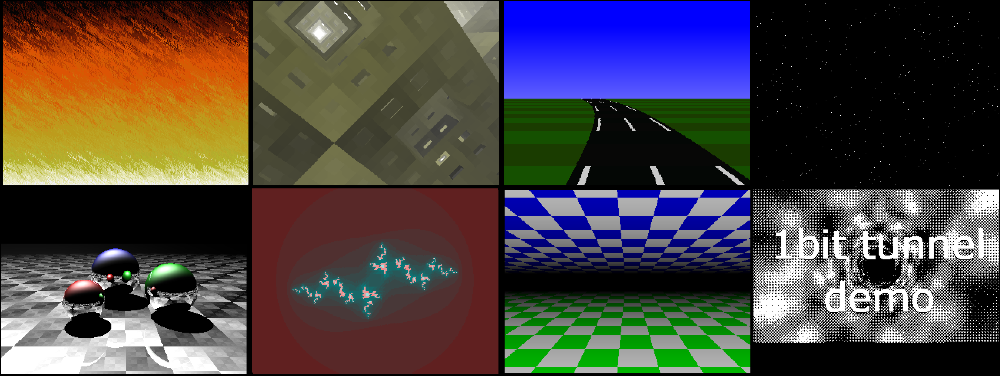

# A catalog of my old-school GFX effects
*Demoparty time!*

These are fun and compact graphics effects that I explored as I was developing
[Silice](https://github.com/sylefeb/Silice/tree/master/projects). Most were
implemented directly in hardware, or as risc-v demos for
[my little CPU cores and SOCs](https://github.com/sylefeb/Silice/tree/master/projects/ice-v).

This repository contains C versions using a minimalistic framework. They should
be very easy to port to run on your own SOC, to port to your own language, or to
revisit in hardware (which was the most fun for me :) ).

I list below each effect. __You can try them from your browser__, as they can
all be compiled with [Emscripten](https://emscripten.org/).

I'll keep expending the list, and if there's interest may do a few deep dives to
explain some of them.

## List

- [`Run doomfire`](https://htmlpreview.github.io/?https://github.com/sylefeb/gfxcat/blob/main/runtime/gfxcat_doomfire.html) [see code](doomfire/doomfire.c)

- [`Run msponge`](https://htmlpreview.github.io/?https://github.com/sylefeb/gfxcat/blob/main/runtime/gfxcat_msponge.html) [see code](msponge/msponge.c)

- [`Run lotus`](https://htmlpreview.github.io/?https://github.com/sylefeb/gfxcat/blob/main/runtime/gfxcat_lotus.html) [see code](lotus/lotus.c)

- [`Run starfield`](https://htmlpreview.github.io/?https://github.com/sylefeb/gfxcat/blob/main/runtime/gfxcat_starfield.html) [see code](starfield/starfield.c)

- [`Run raytrace`](https://htmlpreview.github.io/?https://github.com/sylefeb/gfxcat/blob/main/runtime/gfxcat_raytrace.html) [see code](raytrace/raytrace.c)

- [`Run julia`](https://htmlpreview.github.io/?https://github.com/sylefeb/gfxcat/blob/main/runtime/gfxcat_julia.html) [see code](julia/julia.c)

- [`Run flyover3d`](https://htmlpreview.github.io/?https://github.com/sylefeb/gfxcat/blob/main/runtime/gfxcat_flyover3d.html) [see code](flyover3d/flyover3d.c)

- [`Run tunnel`](https://htmlpreview.github.io/?https://github.com/sylefeb/gfxcat/blob/main/runtime/gfxcat_tunnel.html) [see code](tunnel/tunnel.c)

## Credits

I made all of these effects based on my (not so fresh) memories for my demoscene
days, but all are classics and have been shown many times before!
